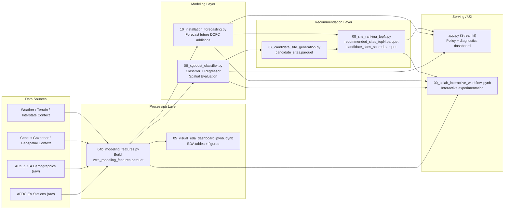
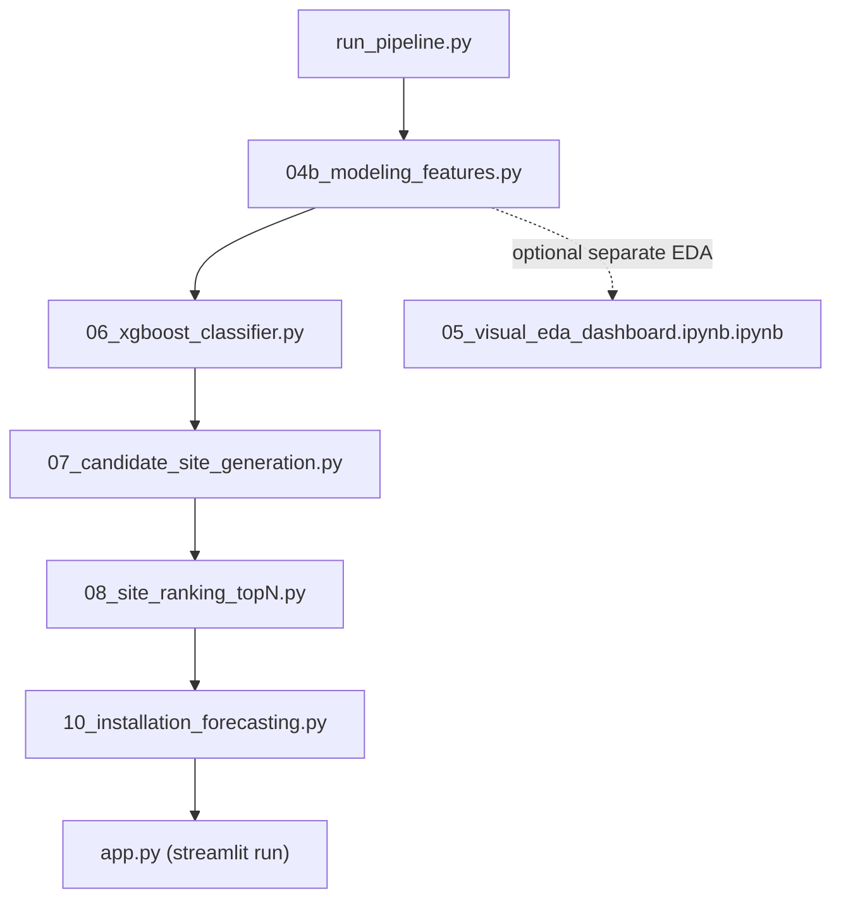
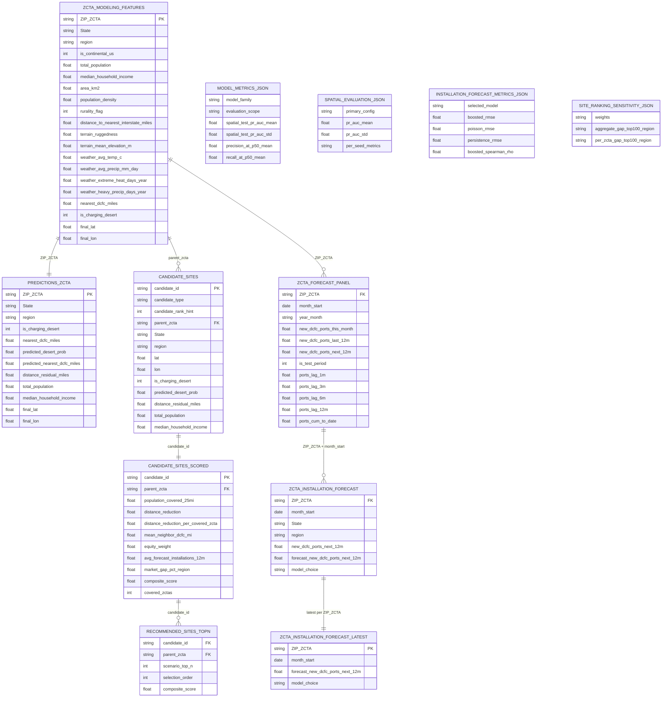
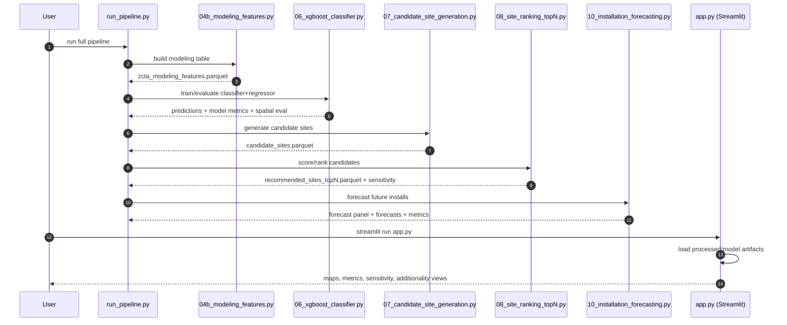

# EV Charging Desert Analysis

End-to-end pipeline for identifying EV charging deserts, evaluating spatial generalization, generating policy-ready site recommendations, and serving an interactive dashboard.

## Overview

This project provides a complete reproducible flow:

1. Build modeling-ready ZCTA features from processed/raw sources.
2. Produce EDA visual outputs for deployment, temporal trends, charger mix, and coverage gaps.
3. Train classifier + regressor models with stratified spatial holdouts.
4. Evaluate robustly across multiple seeds and holdout configurations.
5. Generate candidate charging sites and rank Top-N recommendations.
6. Present findings and diagnostics in Streamlit.

---

## Architecture & Data Model

### 1) Executive System Diagram



### 2) Detailed Pipeline Flow



### 3) ER / Data Schema Diagram



### 4) Sequence Diagram



---

## Repository Structure

```text
ev-charging-analysis/
├── app.py
├── run_pipeline.py
├── requirements.txt
├── data/
│   ├── raw/                     # Original source files (AFDC/Census/etc.)
│   ├── processed/               # Feature tables, predictions, recommendation artifacts
│   └── models/                  # Trained models + metrics/evaluation JSON
├── notebooks/
│   ├── 00_colab_interactive_workflow.ipynb
│   ├── 04b_modeling_features.py
│   ├── 05_visual_eda_dashboard.ipynb.ipynb
│   ├── 06_xgboost_classifier.py
│   ├── 07_candidate_site_generation.py
│   ├── 08_site_ranking_topN.py
│   ├── 09_dashboard.py
│   ├── 10_installation_forecasting.py
│   └── colab_interactive_diagnostics.py
└── reports/
```

---

## Setup

### Environment

```bash
python3 -m venv .venv
source .venv/bin/activate
pip install -r requirements.txt
```

### Run dashboard

```bash
python3 -m streamlit run app.py
```

### Run full pipeline

```bash
python3 run_pipeline.py
```

Default script stages run in order:

- `04b -> 06 -> 07 -> 08 -> 10`

EDA/dashboard notebook is run separately:

- `notebooks/05_visual_eda_dashboard.ipynb.ipynb`

Useful options:

```bash
python3 run_pipeline.py --dry-run
python3 run_pipeline.py --from-stage 06 --to-stage 08
python3 run_pipeline.py --skip 08
```

---

## End-to-End Pipeline Flow

## Stage A: Data and Feature Foundation

### `04b_modeling_features.py`

Builds `data/processed/zcta_modeling_features.parquet` by joining core ZCTA-level coverage/demographic fields with geospatial/weather/terrain context.

Key outputs/columns include:

- Geography keys: `ZIP_ZCTA`, `State`, `region`
- Core demographics: `total_population`, `median_household_income`, `area_km2`, `population_density`, `rurality_flag`
- Context features (if available): interstate distance, terrain, weather
- Targets: `is_charging_desert`, `nearest_dcfc_miles`
- Scope flag: `is_continental_us`

Scope handling:

- Rows are retained for completeness.
- Modeling/evaluation later filters to continental US (`is_continental_us == 1`).

---

## Stage B: EDA Visualization Layer

### `05_visual_eda_dashboard.ipynb.ipynb` (EDA/dashboard notebook)

Generates descriptive visual outputs for:

- EV deployment by state and city
- yearly and monthly installation trends
- charger-type composition over time
- charging-network distribution
- state and station-level maps
- charging desert and adequate-coverage summaries (state/region)

Typical outputs are written to report/figure paths as `.html` and `.png` artifacts, plus summary `.csv` tables.

Purpose:

- Provide descriptive infrastructure context.
- Support communication and reporting.
- Complement (not replace) spatial ML evaluation.

---

## Stage C: ML Training + Spatial Evaluation

### `06_xgboost_classifier.py`

Trains two models:

- **Classifier**: `predicted_desert_prob`
- **Regressor**: `predicted_nearest_dcfc_miles`

Evaluation design:

- Continental-only rows (`is_continental_us == 1`)
- Stratified state holdouts by Census region
- Two configurations evaluated:
  - `holdout_per_region=2`
  - `holdout_per_region=3` (primary)
- Multi-seed evaluation with positive-count floor for robust test sets

Artifacts written:

- `data/models/desert_classifier.pkl`
- `data/models/desert_regressor.pkl`
- `data/models/model_metrics.json`
- `data/models/spatial_holdout_config.json`
- `data/models/spatial_evaluation.json`
- `data/processed/predictions_zcta.parquet`

What `spatial_evaluation.json` contains:

- Primary config summary (mean/std/range-ready metrics)
- Per-configuration (2 vs 3 per region) seed-level audit rows
- Per-seed test states, test desert counts, PR-AUC, precision@0.5, recall@0.5

---

## Stage D: Candidate Generation

### `07_candidate_site_generation.py`

Builds `data/processed/candidate_sites.parquet` from prediction outputs and location features.

Candidate construction includes:

- ZCTA centroid candidates
- small offset candidates for local siting flexibility

Prioritization seed logic combines:

- actual desert label
- classifier risk probability
- high residual-need signal

---

## Stage E: Top-N Site Ranking

### `08_site_ranking_topN.py`

Scores candidate sites against nearby ZCTAs and writes:

- `data/processed/recommended_sites_topN.parquet`

Current ranking logic:

- distance-reduction eligibility gate
- normalized weighted composite of:
  - distance reduction
  - neighborhood need (mean current nearest-DCFC miles)
  - log population covered
  - equity weight

Output scenarios:

- Top-100
- Top-500
- Top-1000

---

## Stage F: Installation Forecasting (Future Additions)

### `10_installation_forecasting.py`

Builds a ZCTA-month panel from historical station open dates and forecasts:

- `new_dcfc_ports_next_12m`

Modeling approach:

- Poisson regression baseline
- Boosted regressor (XGBoost if available, sklearn fallback otherwise)
- Temporal holdout (last 12 months as test)

Writes:

- `data/processed/zcta_forecast_panel.parquet`
- `data/processed/zcta_installation_forecast.parquet`
- `data/processed/zcta_installation_forecast_latest.parquet`
- `data/models/installation_forecast_metrics.json`

Current run snapshot:

- Poisson RMSE: 2.486
- Boosted RMSE: 1.208
- Constant-zero RMSE baseline: 2.495
- Persistence (last-12m) RMSE baseline: 1.258
- Boosted MAE: 0.215
- Boosted Spearman ρ: 0.421
- Target prevalence (>=1 port in next 12m): 6.96%
- Selected model: boosted

---

## Stage G: Dashboard and Policy Diagnostics

### `app.py`

Streamlit dashboard surfaces:

- current desert severity and predicted risk maps
- Top-N recommended site map
- robust spatial evaluation headline:
  - mean/median/std/range PR-AUC
  - 2-vs-3 holdout comparison table
  - per-seed audit expander
- baseline comparison panel
- threshold diagnostics and confusion matrix
- split summary and regional prioritization

Full-dataset scope is hidden behind a debug toggle; spatial evaluation is the default policy view.

---

## Canonical Metrics (Current Run)

All below use continental-US scope and primary 3-per-region 5-seed spatial evaluation unless noted.

### Headline

- Spatial PR-AUC (mean ± std): **0.287 ± 0.080**
- Spatial PR-AUC median: **0.261**
- Spatial PR-AUC range: **0.185 to 0.428**
- Precision@0.5 (mean ± std): **0.349 ± 0.063**
- Recall@0.5 (mean ± std): **0.307 ± 0.117**

### Baselines (spatial test)

- Constant prevalence: **0.013**
- West-only rule: **0.108**
- Population-density-only: **0.141**
- Full model: **0.287**

### Agreement diagnostics (classifier vs regressor)

- Both-flagged (`p>=0.5` and `distance>50`): 178 ZCTAs, **83.1%** actual desert rate
- Classifier-only (`p>=0.5` and `distance<=50`): 647 ZCTAs, **32.1%** actual desert rate

Interpretation:

- Both-flagged is a high-confidence investment tier.
- Classifier-only is a broader watchlist/screening tier.

### Top-100 siting distribution

- West: 54
- South: 43
- Midwest: 3
- Northeast: 0

## Methodology Caveat: Aggregate vs Per-ZCTA Gap

`distance_reduction` in ranking is an aggregate benefit summed across covered ZCTAs.
This couples gap severity with coverage volume (and indirectly population density).
To keep this explicit, we report both aggregate-gap and per-covered-ZCTA sensitivity:

| Scenario | West | Midwest | South | Northeast |
|---|---:|---:|---:|---:|
| Aggregate-gap Top-100 (published) | 54 | 3 | 43 | 0 |
| Per-ZCTA-gap Top-100 (sensitivity) | 69 | 9 | 21 | 1 |

Interpretation: South-heavy recommendations are partly driven by high aggregate
coverage across many ZCTAs, while per-location gap severity shifts more weight
toward Western and Midwestern sites.

---

## Reproducibility Checklist

1. Activate environment and install requirements.
2. Run `python3 run_pipeline.py`.
3. Confirm new artifacts in `data/models/` and `data/processed/`.
4. Launch Streamlit and verify headline matches `spatial_evaluation.json`.

---

## Colab / Interactive Analysis

Use:

- `notebooks/00_colab_interactive_workflow.ipynb`
- `notebooks/colab_interactive_diagnostics.py`

These provide:

- setup + sync
- staged pipeline execution
- table inspections
- seed diagnostics
- feature importance plots
- quick experiment loops

---

## Known Limitations

- Distance is straight-line (Haversine), not road-network travel time.
- Seed variability reflects genuine geographic heterogeneity.
- Regional reliability is uneven; low-positive regions require pooled/guarded reporting.

---

## License

Academic/project use within this repository context.
